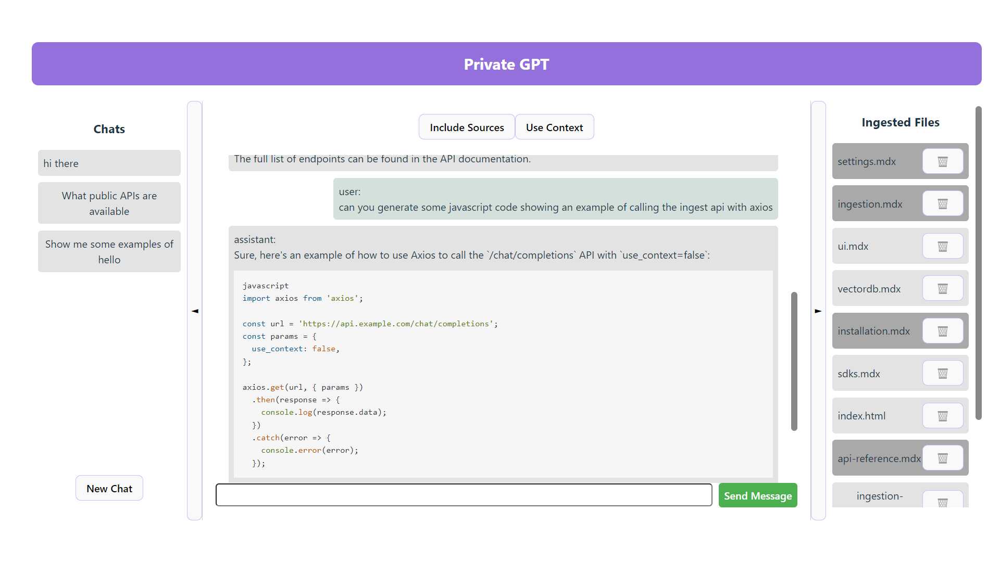

# Private GPT UI

A frontend for [imartinez/privateGPT](https://github.com/imartinez/privateGPT).

Developed with Vite + Vue.

To run the app in dev mode:
 - Clone the repo
 - run `npm install`
 - run `npm run dev`

 NB: ensure you have node+npm installed

 To see a deployed version of the UI that can connect to a privateGPT instance available on your network use:

https://gianniacquisto.github.io/privateGPT-ui/

Common Issues:
If you are seeing CORS errors make sure you have enabled CORS in your privateGPT deployment settings.
